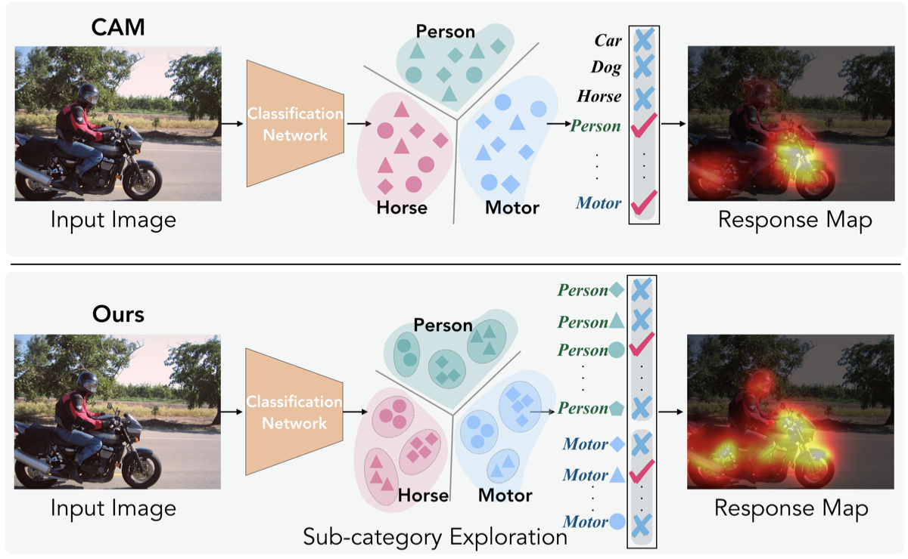

# Weakly-Supervised Semantic Segmentation via Sub-category Exploration



## Introduction
The code and trained models of:

**Weakly-Supervised Semantic Segmentation via Sub-category Exploration, [Yu-Ting Chang](https://scholar.google.com/citations?user=5LRrNYgAAAAJ&hl=en), [Qiaosong Wang](https://scholar.google.com/citations?user=uiTAQLEAAAAJ&hl=en), [Wei-Chih Hung](https://scholar.google.com/citations?user=AjaDLjYAAAAJ&hl=en), [Robinson Piramuthu](https://scholar.google.com/citations?user=2CkqEGcAAAAJ&hl=nl), [Yi-Hsuan Tsai](https://scholar.google.com/citations?user=zjI51wEAAAAJ&hl=en) and [Ming-Hsuan Yang](https://scholar.google.com/citations?user=p9-ohHsAAAAJ&hl=en), CVPR 2020** [[Paper]](https://arxiv.org/abs/2008.01183)


We develope a framework to generate semantic segmentation labels of images given their image-level class labels only. We propose a simple yet effective approach to improve the class activation maps by introducing a self-supervised task to discover sub-categories in an unsupervised manner. Our algorithm produces better activation maps, thereby improving the final semantic segmentation performance.


## Citation
If you find the code useful, please consider citing our paper using the following BibTeX entry.
```
@InProceedings{Chang_2020_CVPR,
author = {Chang, Yu-Ting and Wang, Qiaosong and Hung, Wei-Chih and Piramuthu, Robinson and Tsai, Yi-Hsuan and Yang, Ming-Hsuan},
title = {Weakly-Supervised Semantic Segmentation via Sub-category Exploration},
booktitle = {The IEEE Conference on Computer Vision and Pattern Recognition (CVPR)},
year = {2020}
}
```


## Prerequisite
* Tested on Ubuntu 14.04, with Python 3.5, PyTorch 1.0.1, Torchvision 0.2.2, CUDA 9.0, and 1x NVIDIA TITAN X GPU.
* [The PASCAL VOC 2012 development kit](http://host.robots.ox.ac.uk/pascal/VOC/voc2012/):
You need to specify the path ('voc12_root') of your downloaded dev kit.
* To extract the feature for the first round training, you need to download the pretrained weight of the [AffinityNet](https://github.com/jiwoon-ahn/psa) [[res38_cls.pth]](https://drive.google.com/file/d/1xESB7017zlZHqxEWuh1Rb89UhjTGIKOA/view?usp=sharing)
* To train the classification model, you need to download the pretrained weight of the [Mxnet and ResNet-38](https://github.com/itijyou/ademxapp) model [[ilsvrc-cls_rna-a1_cls1000_ep-0001.params]](https://drive.google.com/file/d/1YB3DkHiBeUH5wn6shk93jChvXwfOxwBE/view?usp=sharing)
* Please create a folder named weights and save pretrained models in the folder.


## Usage
### Run the whole pipeline
- We iteratively train the model with three rounds to achieve the best performance. You can directly run script.sh to complete the three-round training.
- [Note] To run the whole pipeline, you need to specify the path to the saved model for each round. Please see the command in script.sh.
```
bash script.sh
```

### Run each step
- The iteratively training process includes the step of feature extraction, sub-category label generation, and classification model training. You can use following scripts to run each step.
- [Note] Please specify the argument in the command. You can also check script.sh to see more details.

#### 1. Extract the feature from the model
```
bash python extract_feature.py --weights [your_weights_file] --infer_list ./voc12/train_aug.txt --voc12_root [your_voc12_root_folder] --save_folder [your_save_folder] --from_round_nb [round_number]
```

#### 2. Generate sub-category labels
```
bash python create_pseudo_label.py --save_folder [your_save_folder] --k_cluster 10 --for_round_nb [round_number]
```

#### 3. Train the classification model with the parent label and the sub-category label
```
bash python train_cls.py --lr 0.01 --voc12_root [your_voc12_root_folder] --weights [your_weights_file] --round_nb [round_number] --save_folder [your_save_folder]
```

### Infer the classifier and obtain the response map
- With the classification model, you can infer the classifier and generate the response map
```
bash python infer_cls.py --infer_list voc12/train.txt --voc12_root [your_voc12_root_folder] --weights [your_weights_file] --save_path [your_save_cam_folder] --save_out_cam 1 --round_nb [round_number]
```


## Results and Trained Models
#### Class Activation Map

| Model         | Train (mIoU)    | Val (mIoU)    | |
| ------------- |:-------------:|:-----:|:-----:|
| ResNet-38     | 50.9 | 49.6 | [[Weights]](https://drive.google.com/file/d/1Qgd7bC8YnfBs02fdwwMIji9s9xnX7jAt/view?usp=sharing) |


## Refinement and segmentation network
* Refinement: We adopt the random walk method via affinity to refine the map as pixel-wise pseudo ground truths for semantic segmentation. Please refer to [the repo of AffinityNet](https://github.com/jiwoon-ahn/psa) [1].
* Segmentation network: We utilize the Deeplab-v2 framework [2] with the ResNet-101 architecture [3] as the
backbone model to train the segmentation network. Please refer to [the repo](https://github.com/kazuto1011/deeplab-pytorch).


## Reference
1. Jiwoon Ahn and Suha Kwak. Learning pixel-level semantic affinity with image-level supervision for weakly supervised semantic segmentation. CVPR, 2018.
2. Liang-Chieh Chen, George Papandreou, Iasonas Kokkinos, Kevin Murphy, and Alan L Yuille. Deeplab: Semantic image segmentation with deep convolutional nets, atrous convolution, and fully connected crfs. TPAMI, 2017.
3. Kaiming He, Xiangyu Zhang, Shaoqing Ren, and Jian Sun. Deep residual learning for image recognition. CVPR, 2016.
